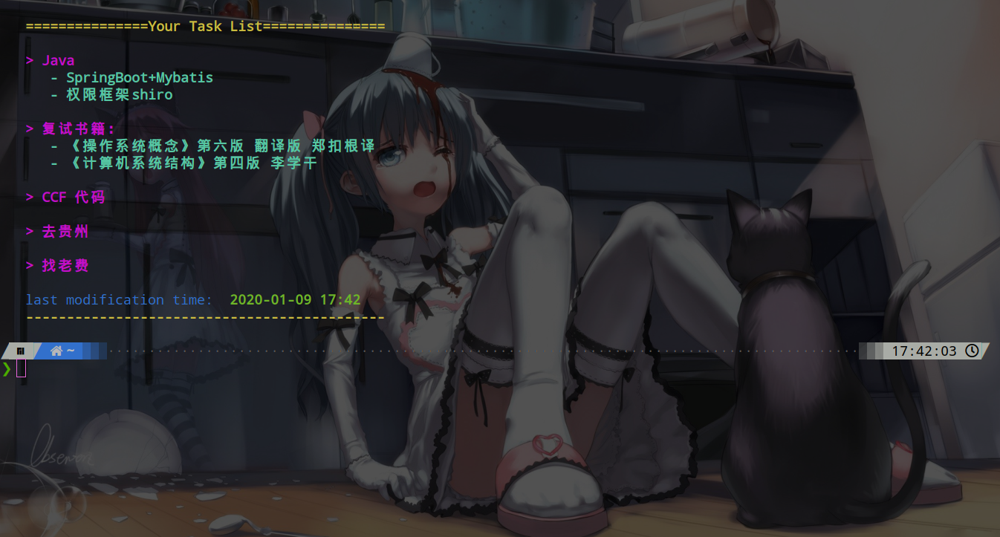
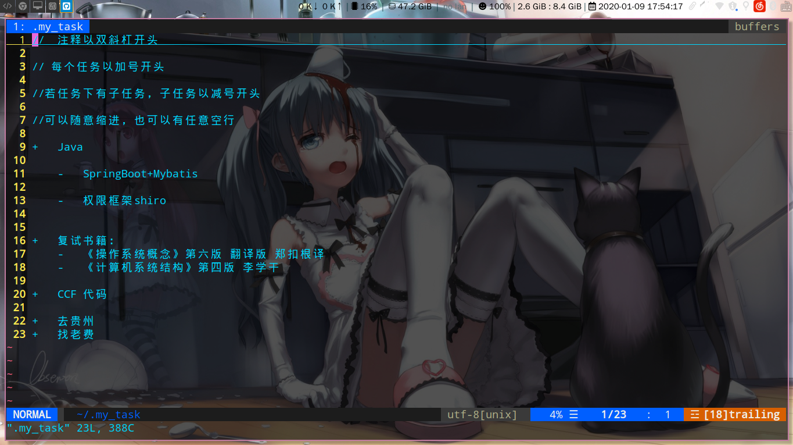

## 一个任务提醒程序

> 这个小程序写于考研结束的第二天，因为我记性不太好，有时任务一多，就会丢三落四，于是想着写一个小程序来提醒自己。本来想用别人的，但是没找到使用vim来编辑任务的，作为vim的教徒这可不能忍

### 配置方式

+	执行 install.py 即可(用普通用户，不要使用root来执行!!)

### 功能介绍

+	打开终端时，会打印你当前的任务，或者也可以通过`task.py`命令来打印当前任务：

	

+	初次使用时，会首先在配置的目录下创建 任务 文件，你可以通过修改配置文件来修改任务的文件名与目录

+	此程序支持两级任务(任务下有子任务)，暂不支持更多级

+	功能暂时就这么多吧，因为这些完全够自己用了，后期有新的需求会考虑加进去

### 使用方式

+	通过编辑 `.my_task` 文件来编辑任务，可以使用 `//` 来进行注释，注释掉的不会被打印出来

+	通过加号`+`来指定一个任务，左右均可有空格

+	通过减号`-`来指定一个子任务，各个任务之间可以间隔任意空行

	

### notify-send

+	通知程序需要自己设定开机自启，我使用的是i3-gaps，直接将 `exec_always task_notify.py` 写入i3的配置文件即可

+	可以将通知关掉，将配置文件中的switch设置为off即可

+	目前只支持设定通知隔多久显示一次，全屏时不会显示

+	效果图：

	
